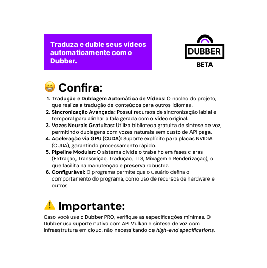



# 🎙️ Dubber PRO

Dubber PRO é um aplicativo de tradução e dublagem automática de vídeos, inspirado no funcionamento do YouTube, permitindo que conteúdos sejam traduzidos para outros idiomas com voz sincronizada, natural e de alta qualidade.

### Atributos

- Tradução automática de vídeos;
- Dublagem com vozes neurais;
- Sincronização labial e temporal;
- Controle de volume entre vídeo original e dublagem;
- Centralização de áudio e correção estéreo;
- Processamento eficiente;
- Interface simples e intuitiva.

### Requisitos Mínimos

1. **CPU:** 4 núcleos (8 threads) ou mais (Ryzen 5 ou Intel i5);
2. **Memória RAM:** 16 GB ou mais (sendo 8 GB o mínimo absoluto);
3. **GPU (altamente recomendado):** NVIDIA com suporte para CUDA ou AMD (6GB de VRAM ou mais);
4. **Armazenamento:** SSD e outros meios eficientes;
5. **Internet:** 100 mbps ou mais.

### Download

Será disponibilizado uma build para Windows no futuro para arquiterura 64 bits.

### Sobre

O projeto entrou em desenvolvimento no dia 21 de Janeiro de 2026. E continuará sendo desenvolvido com meta de aperfeiçoamento. O projeto se encontra em versões iniciais e de teste.
